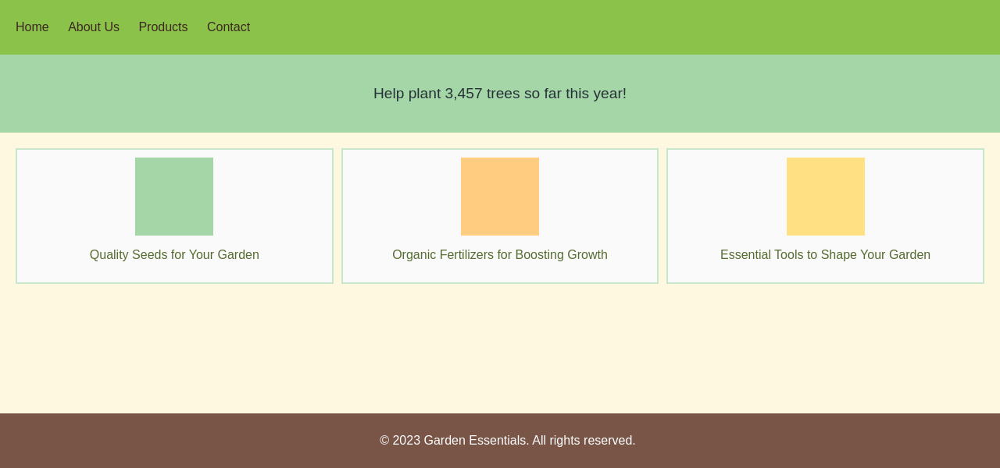
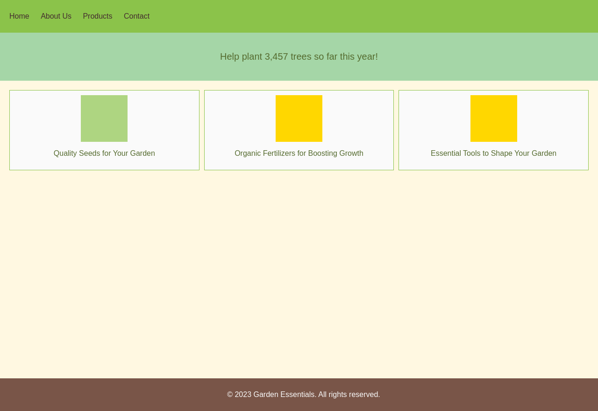

# WAFFLE: Multi-Modal Model for Automated Front-End Development
We develope WAFFLE, a fine-tuning approach to train multi-modal LLM (MLLM) to generate HTML code from webpage screenshots or UI designs. WAFFLE uses a structure-aware attention mechanism to improve MLLMs' understanding of HTML's structure and a contrastive fine-tuning approach to align MLLMs' understanding of UI images and HTML code. Models fine-tuned with WAFFLE show up to 9.00 pp (percentage point) higher HTML match, 0.0982 higher CW-SSIM, 32.99 higher CLIP, and 27.12 pp higher LLEM on our new benchmark WebSight-Test and an existing benchmark Design2Code.

## Updates:
* 10/24/2024: Our preprint avaiable at: [preprint](https://arxiv.org/abs/2410.18362)
* 10/24/2024: Our code (keep maintaining) avaiable at: [code](https://github.com/lt-asset/Waffle)
* 10/24/2024: Our fine-tuned Waffle_VLM_WebSight (7B), using DoRA, is released at: [lt-asset/Waffle_VLM_WebSight](https://huggingface.co/lt-asset/Waffle_VLM_WebSight), the base checkpoint is released by HuggingFaceM4, available via this [link](https://huggingface.co/HuggingFaceM4/VLM_WebSight_finetuned).

## Dependency
- peft               0.11.1
- transformers       4.41.1
- pytorch       2.3.0
- selenium
- Python 3.10.14
- deepspeed          0.14.1
- datasets 2.19.1
- beautifulsoup4     4.12.3
- accelerate         0.30.1

## Structure
- `vlm_websight` contains the dataset class file, model class files, and training file for vlm_websight.
    - `eval_websight.py` is the inference file
    - `dataset.py` is the dataset class file
- WebSight-Test is one of our test dataset

## Quick Start
```bash
cd vlm_websight
# generate HTML/CSS code for UI image --image_path, save the code to --html_path
python quick_start.py --image_path ../WebSight-Test/test-495.png --html_path examples/example-495.html
# render the HTML/CSS code in --html_path, and save the rendered image to --image_path
python render_html.py --html_path examples/example-495.html --image_path examples/example-495.png
```

## Example
* Input UI design



* Waffle-VLM-WebSight generated HTML code

[example-495.html](vlm_websight/examples/example-495.html)

* Rendered Waffle-VLM-WebSight output




## Citation
```
@misc{liang2024wafflemultimodalmodelautomated,
      title={WAFFLE: Multi-Modal Model for Automated Front-End Development}, 
      author={Shanchao Liang and Nan Jiang and Shangshu Qian and Lin Tan},
      year={2024},
      eprint={2410.18362},
      archivePrefix={arXiv},
      primaryClass={cs.SE},
      url={https://arxiv.org/abs/2410.18362}, 
}
```